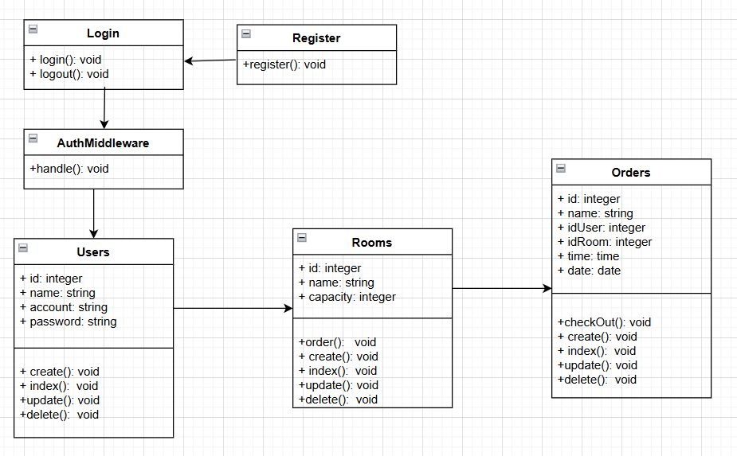
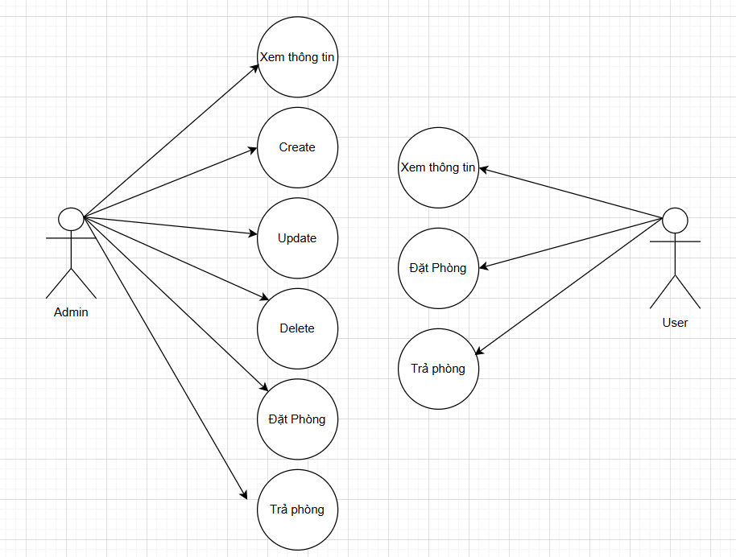
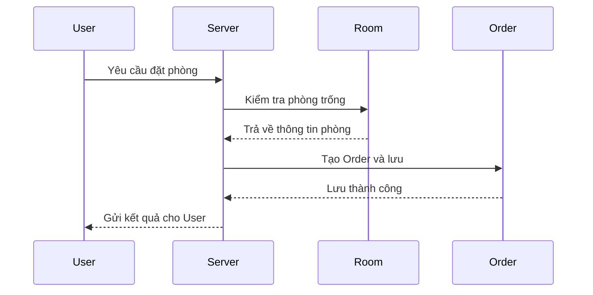
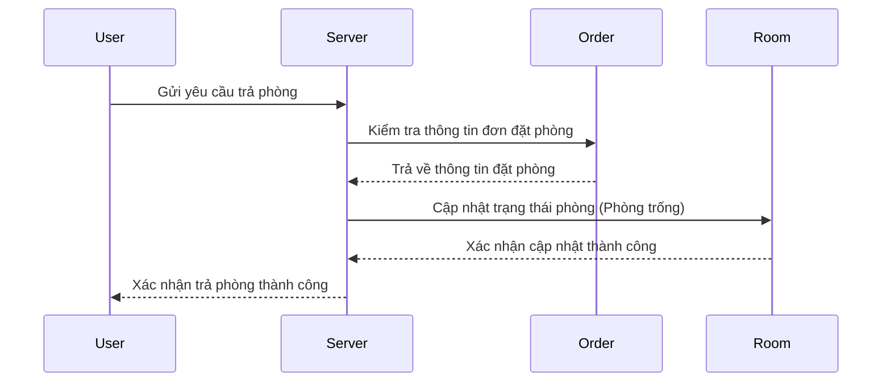
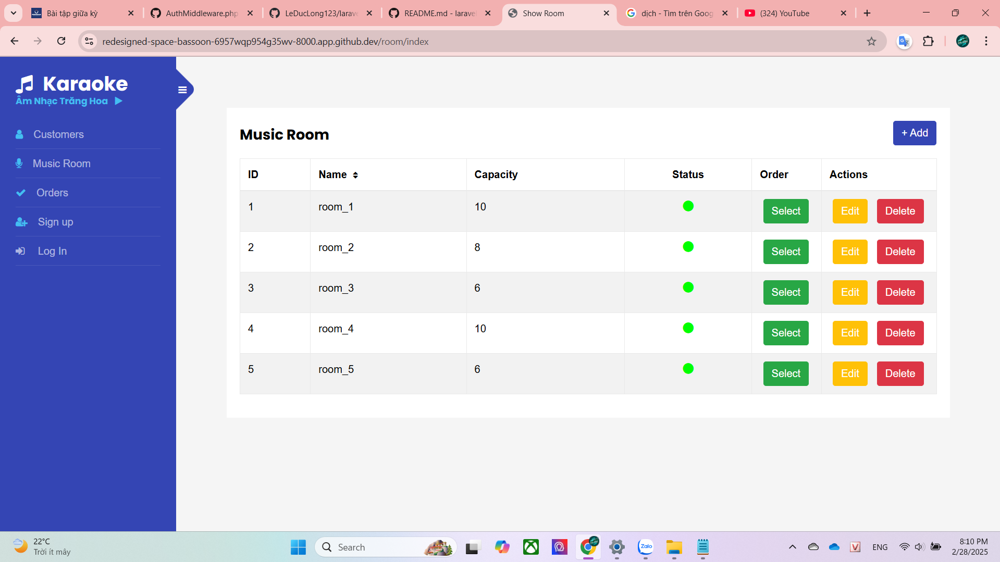
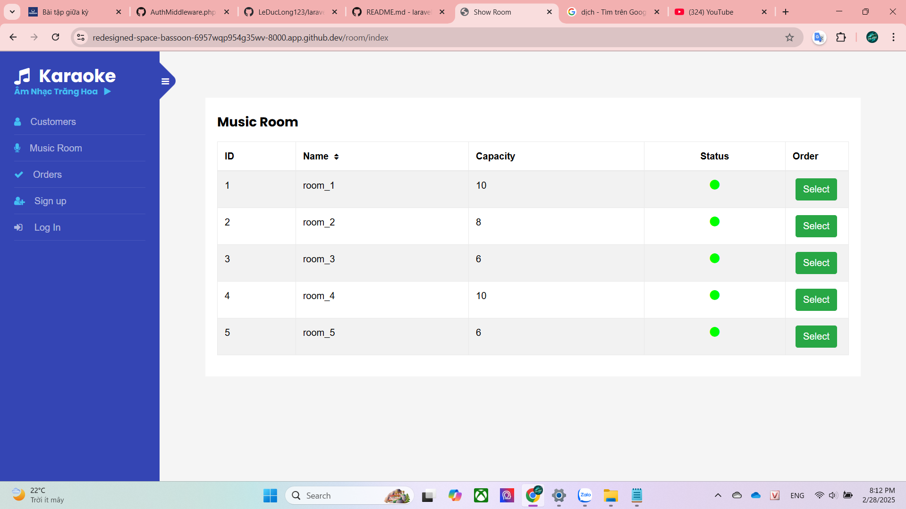

# Project: Music Room

---


--- 

## About the project

The karaoke room booking web application allows users to book and check out rooms quickly online. The simple interface is designed to provide an easy user experience for booking or checking out. The system assigns different roles and permissions for regular users and administrators (Admin). <br>

- Link website: https://redesigned-space-bassoon-6957wqp954g35wv-8000.app.github.dev
- Link repository: https://github.com/LeDucLong123/laravel_1/tree/main/Music

## Main Features

1. User
View available rooms: Users can see the list of available rooms.
2. Room
Room details: Allows users to view the list of rooms along with detailed information about each room, including room type and status (available or booked).
Admin privileges: Only administrators (Admin) have the right to add, edit, or delete rooms.
3. Order
Automatic order creation: When a booking is successful, the system automatically creates an Order with full details, including user information, booked room, and the duration of the stay.
4. Admin
User management: Only administrators have the right to add, edit, or delete user accounts.

## Technologies Used

- Laravel Framework
- OOP PHP
- MVC Architecture

---

## Deployment Guide(Local Development Environment)
1. Clone the Repository
```php
git clone https://github.com/LeDucLong123/laravel_1.git
```
```php
cd Music
```
2. Install Dependencies:
```php
composer install
```
3. Set Up Environment Variables:
```php
cp .env.example .env
```
```php
php artisan key:generate
```
4. Configure Database Settings:
- Correct configuration with the database on your local machine
- After registering or creating an account, you need to access the database and set the users table to have column userRole = 1 to use **ADMIN** rights.
5. Run Migrations and Seed the Database:
```php
php artisan migrate
```
6. Start the Local Development Server:
```php
php artisan serve
```
7. Access the Application:
- Access your website: http://localhost:8000

---

## UML - Class Diagram



---

## Use Case Diagram



---

## Sequence Diagram :Booking Room


---

## Sequence Diagram :Check-out


---

## Admin Role



## User Role



<br>


